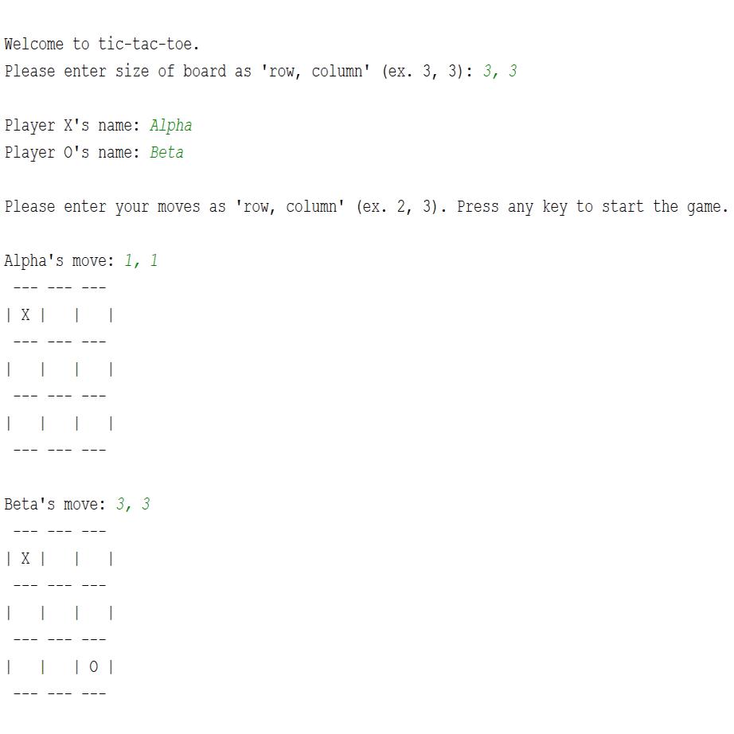
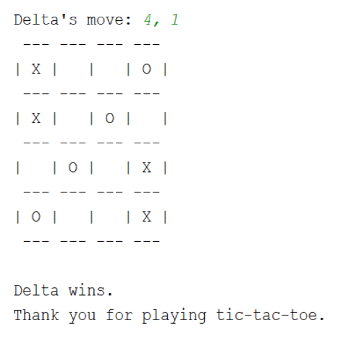

<div class="ui medium rounded images">
  
  
</div>


This program is a basic, non-graphical implementation of tic-tac-toe based on four exercises found on Michele Pratusevich's [practicepython.org](https://www.practicepython.org/about/). 

In ["Exercise 24 Draw a Game Board"](https://www.practicepython.org/exercise/2014/12/27/24-draw-a-game-board.html), a module to print the arbitrarily sized game board as a single ```string```, a module to check throughout the game if and which player won, a module to modify the ```string``` board with the players' moves during the actual game, and putting all those modules together to create the game. In addition to the 


I found this website during the summer after my first year of programming courses in college. That summer was when I decided to brush up on my programming skills by revisiting general programming fundamentals by learning Python after reflecting on that first year. I was exposed to the intricacies of how logic is applied in programming and the multitude of methods for storing and accessing data, but those courses were difficult for me, and I wasn't able to grasp all that I was taught. Instead of being whole and organized, I felt like my understanding of what I learned in those courses was muddled and contained holes of missing information I failed to retain. This project helped me 


["Exercise 24 Draw a Game Board"](https://www.practicepython.org/exercise/2014/12/27/24-draw-a-game-board.html)
["Exercise 26 Check Tic Tac Toe"](https://www.practicepython.org/exercise/2015/11/16/26-check-tic-tac-toe.html)
["Exercise 27 Tic Tac Toe Draw"](https://www.practicepython.org/exercise/2015/11/26/27-tic-tac-toe-draw.html)
["Exercise 29 Tic Tac Toe Game"](https://www.practicepython.org/exercise/2016/08/03/29-tic-tac-toe-game.html)


