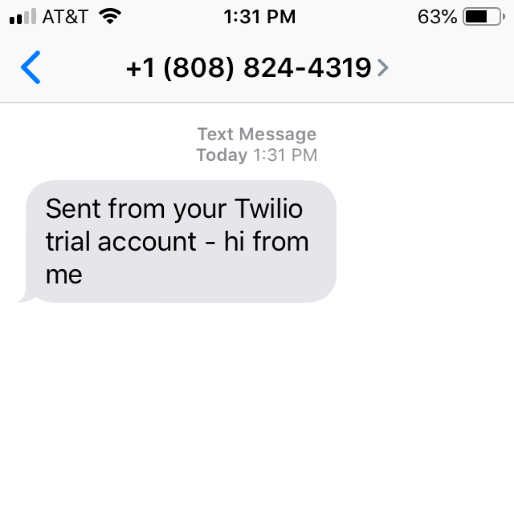

Learning how to navigate through a new operating system and discovering one's favorite aspects about it can be an interesting and exciting experience. However, the lack of the cross-platform characteristic in the applications and services one used on a previous operating system might dim the thrill of that experience and upset routine. My life revolves around a laptop but not so much a phone, and so, I was appreciative for iMessages since it allowed me to send and receive text messages on my MacBook to and from my iPhone, a feature I missed a lot when I started using a Windows laptop while still owning said iPhone. I was, thus, ecstatic when I saw the title of Chapter 16, "Sending Email and Text Messages", from Al Sweigart's [*Automating the Boring Stuff with Python*](https://automatetheboringstuff.com/) where it teaches how to send SMS messages with Twilio. 

After reading it, though, I realized this wasn't going to be my ideal "replacement" method for texting via laptop, but I was still interested in seeing the process and result of creating this Python program while also learning what Twilio is and how to use it. Twilio is a service that provides APIs for video, messaging, and voice communication for web and mobile applications. Before writing any actual code, I had to sign up for a free trial account (Twilio free trial accounts don't expire) on their website. With that account, I could then register for a single Twilio phone number to send SMS messages from. Using ["The Twilio Python Helper Library"](https://www.twilio.com/docs/libraries/python) as my guide, I then began writing my program, with the following being the general process: import the necessary Twilio module, create a Client instance and with my account SID and authentication token, and call the function associated with that instance to send a SMS message. 

