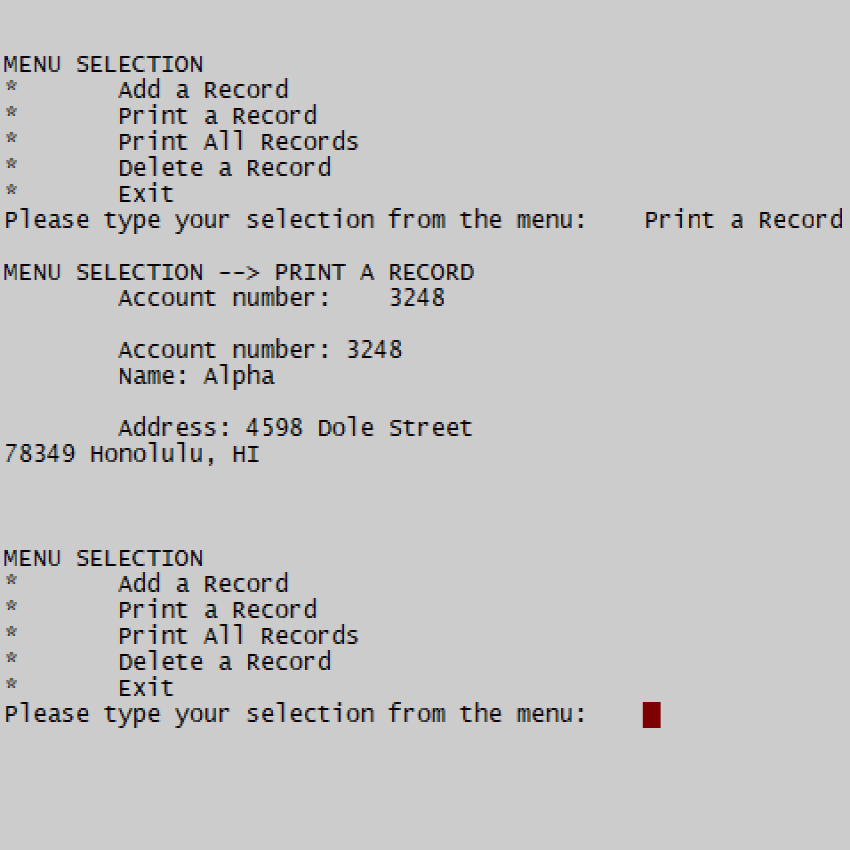
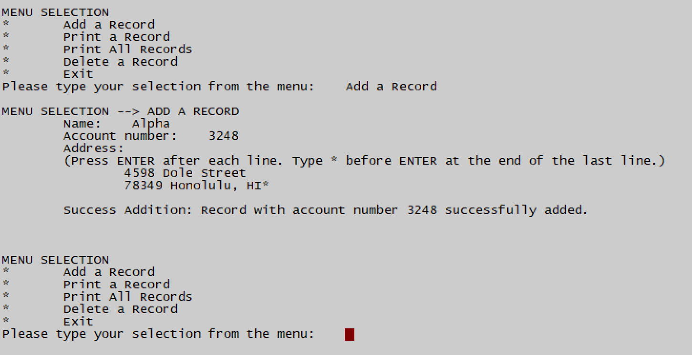

<div class="ui medium rounded images">
  
  
</div>

For this simulation of a bank database I programmed for my ICS 212 course, users are able to add a new bank record, display previous bank records, and delete a previous bank record, where each bank record contains the name, account number, and address of a user. The program displays these options along with another to exit the program in the user interface. The records are implemented as a structure and the bank database is implemented as a linked list of those structures. Though this functionality isn't made available in the user interface, this program also contains a function for copying names, account numbers, and addresses from a text file into the appropriate fields of a new record structure to add to the linked list. It also contains another function for the opposite purpose--copying names, account numbers, and addresses from the appropriate fields of a previous record structure to a text file. These two functions were specifically created to work for the following format of the text file:

````
  [name]
  [account number]
  [single-lined address]
  [newline character]
````


